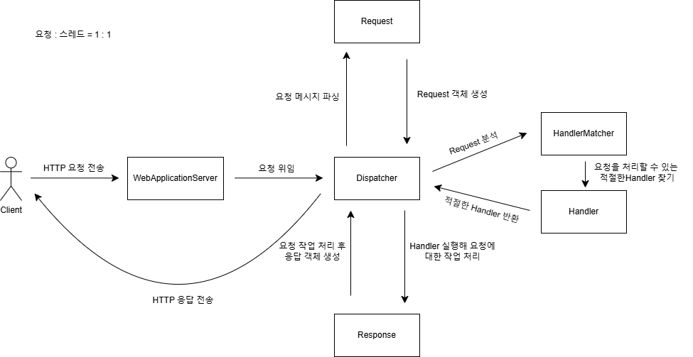

# 직접 만들어 보는 Web Server(v1.0.0)

## 프로젝트 목적

1. HTTP 프로토콜 학습: HTTP 요청/응답 구조와 동작 원리를 이해한다.
2. 웹 서버 동작 원리를 학습한다.

## 배포(v1.0.0)
완성된 프로젝트가 아닙니다. 계속해서 발전시켜 나갈 것입니다.

### [DockerHub 주소](https://hub.docker.com/repository/docker/junsk50/was-gutss/general)

### 다운로드
```
// 이미지 가져오기
docker pull junsk50/was-gutss:latest

// 컨테이너 실행
docker run -p 8080:8080 junsk50/was-gutss
```

### 사용 방법
* 브라우저에서 http://localhost:8080/test.png 에 요청 보내면 테스트용 정적 파일을 응답 받을 수 있습니다. (이후 버전에서 기능을 계속 추가할 예정입니다.)


## 프로젝트 요구사항 및 설계
### [단계별 요구사항](https://royal-manatee-71e.notion.site/WAS-176b6f16bdf880b1885efb0c46af8773)
### [도메인 모델링(v1.0.0)](https://royal-manatee-71e.notion.site/v1-0-0-1b8b6f16bdf880f4a049e106a6567c91)

현재 버전(v1.0.0)은 2단계 요구사항 마무리 중입니다.

## 프로젝트 구조


## 개선 사항(v1.0.0)
* 코드 리팩토링
    * 현재 응답 처리 부분의 책임 분리가 필요합니다.
    * 정적 파일 유형에 따라 동적으로 Content-Type을 설정해줘야 합니다.
    * /../ 같은 path 입력으로 다른 파일에 접근하는 인젝션을 막는 로직이 필요합니다.


## 기술 스택

* 언어: Java(17)
* 빌드 도구: Gradle
* 테스트: JUnit5
* IDE: IntelliJ IDEA
* 버전 관리: Git

